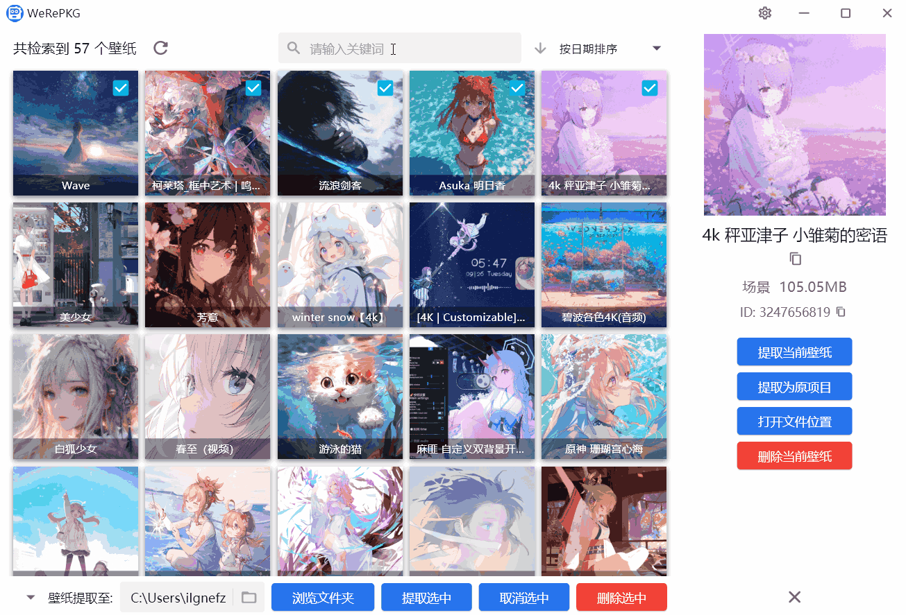
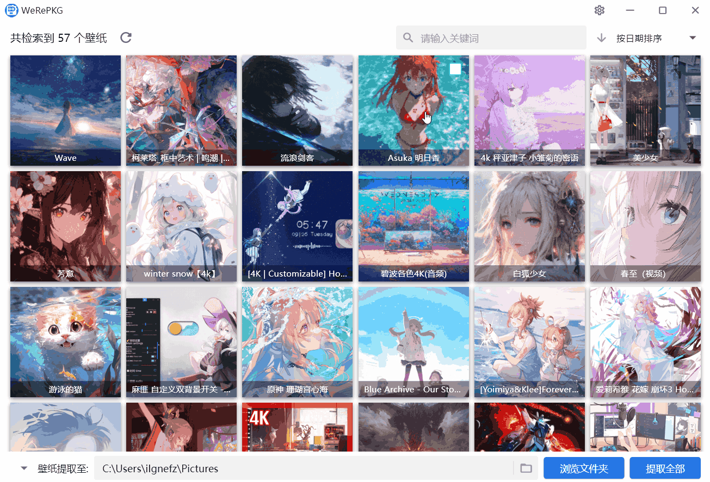
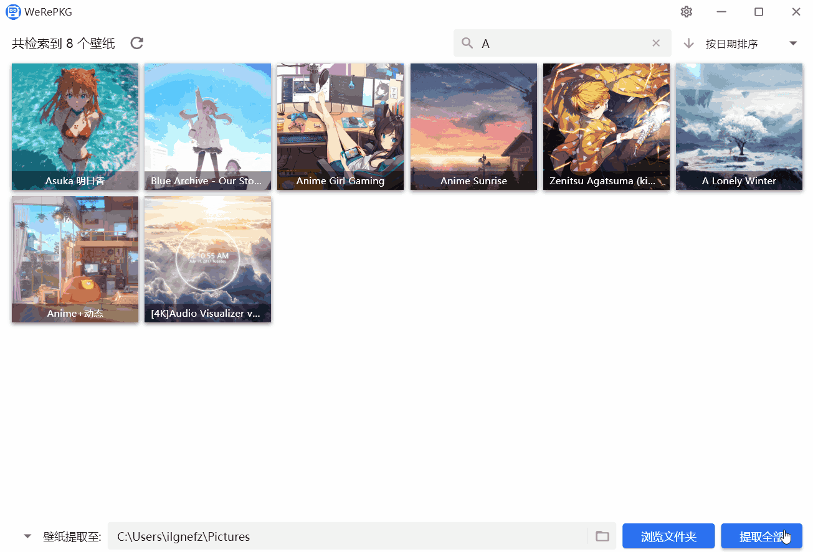

<h2>Wallpaper Engine Wallpaper Extraction Tool, Developed Based on the Open-Source Project <a href="https://github.com/notscuffed/repkg">RePkg</a></h2>

[简体中文](README.md) | English

## Language Support
* Chinese (Simplified)
* English

## Quick Start

The software will automatically detect and recognize wallpapers downloaded by Wallpaper Engine. You can also manually modify the wallpaper path in the settings if needed.
When the software is launched for the first time, it will automatically hide web-based and application-type wallpapers. You can manually enable their display in the settings:

Use the filters in the settings to accurately find the wallpapers you want to export:

You can also search for wallpapers by name:

After subscribing to new wallpapers on Wallpaper Engine, you can click the refresh button to load them into the tool:

As an auxiliary tool for Wallpaper Engine, its operation logic is designed to be consistent with Wallpaper Engine for a seamless experience.
You can click on a specific wallpaper to perform individual operations:

The right-side menu may vary slightly depending on the wallpaper type. For example, video wallpapers allow you to play the video directly using your system's default media player:

You can select multiple wallpapers for batch extraction by checking the box in the upper-right corner of each wallpaper:

You can also hold the Ctrl key and click to quickly toggle the selection status (alternatively, use the Shift key to select a continuous range of wallpapers):

If no wallpapers are selected, the software will export all currently displayed wallpapers by default:

You can also export only the selected wallpapers via multi-selection:

Before extraction, you can configure the export settings in the "Settings" menu:

When you unsubscribe from a wallpaper on Wallpaper Engine, it will not be deleted immediately. You can manually delete it to the Recycle Bin within this tool:

## License

[GPL-2.0](LICENSE)