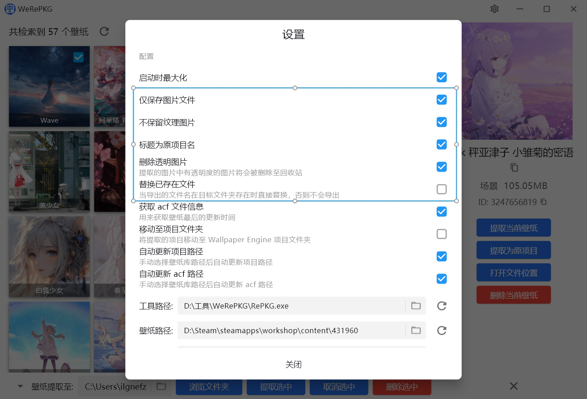

<h2>Wallpaper Engine 壁纸提取工具，基于开源项目 <a href="https://github.com/notscuffed/repkg">RePkg</a> 开发</h2>

简体中文 | [English](README-EN.md)

## 语言支持
* 中文
* English

## 快速上手

软件会自动寻找并识别 Wallpaper Engine 下载的壁纸，你也可以手动在设置里面修改。

软件第一启动会自动隐藏网页和程序类的壁纸，可以手动在设置里面打开：

通过设置的过滤来精准的找到我们需要导出的壁纸：

也可以通过搜索名称：

当我们在 Wallpaper Engine 上订阅了新的壁纸后，可以通过刷新来加载：

作为 Wallpaper Engine 的辅助类软件，操作逻辑自然也要与之对齐。

我们可以通过点击某个壁纸来进行单独操作：

不同类型的壁纸右侧显示菜单会有点差异，比如视频壁纸可以直接调用系统默认播放器来播放：

我们可以通过点击每个壁纸右上角的选择框来选择需要一起提取的多个壁纸：

也通过按住 Ctrl 键来点击快速切换选中状态（当然，也可以通过 Shift 键来快速选中）：

当我们没有选中任何壁纸时默认提取所有显示的壁纸：

也可以通过多选来提取选中的壁纸：

在提取前，你可以在设置里面对提取的内容进行设置：

当我们在 Wallpaper Engine 取消某个壁纸的订阅后，它不会立马被删除，你可以通过在本软件内手动删除至回收站

可以通过在左下角切换来更改批量将文件提取为壁纸还是项目

## License

[GPL-2.0](LICENSE)
